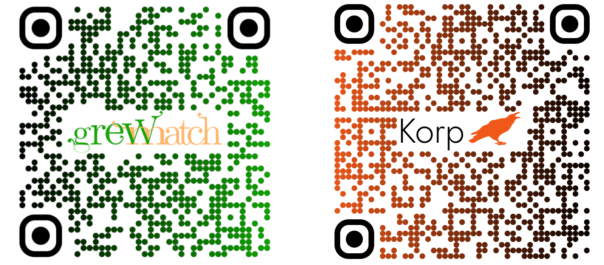

## Andraspråkskorpusar

\bigskip \bigskip \bigskip

### Swedish (SweLL)
\small
```xml
<sentence> <w ref="1">"</w> <w ref="2" target_form="Det" 
correction_label="L-Ref">Den</w> <w ref="3">är</w> 
<w ref="4">en</w> <w ref="5">tredjedel</w> 
<w ref="6">av</w> <w ref="7">din</w> <w ref="8">dag</w> 
<w ref="9">!</w> </sentence>
```

### English (FCE)
\small
```xml
I also suggest that more plays and films should 
<ns type="RV"> <ns type="FV"><i>be taken</i><c>take</c>
</ns> place</ns>.
```

### Italian (VALICO)
\small
```xml
Finse <MC><i>aveva paura</i><c>che aveva paura</c>
</MC> di un <DN><i>rapito</i><c>rapimento</c></DN>.
```

## Begränsningar
- olika format som är inkompatibla med varandra
- manuell taggning
- grovkorniga felkategoritaggar
- snäv inriktning på språkliga fel

## Universal Dependencies
- ett ramverk för att skapa morfosyntaktiska analyser som är
  - tvärspråkligt konsekventa
  - läsbara för både människor och maskiner
  - tillämpliga i både en- och flerspråkiga användningsscenarier
- en växande samling trädbanker för 180+ språk

## UD för andraspråksdata

- UD:s __standardformat__ (CoNLL-U) tillgängliggör etablerade sök- och bearbetningsverktyg 
- befintliga __parsrar__ underlättar annoteringen
- __detaljerade morfosyntaktiska analyser__ kan användas för att studera L2-grammatik i stort
- __tvärspråklig konsekvens__\* gör det möjligt att jämföra:
  - andraspråksproduktionerna med målspråket
  - andraspråket med modersmålet hos samma grupp
  - olika andraspråk hos samma grupp

## \* OBS!
### TL;DR:
De officiella UD-riktlinjerna specificerar **_inte_** hur alla andraspråksfenomen ska analyseras; därför är andraspråksträdbanker **_inte_** 100% kompatibla med varandra

\bigskip

### Läs mer:
Arianna Masciolini, Aleksandrs Berdicevskis, Maria Irena Szawerna, and Elena Volodina. _Annotating second language in Universal Dependencies: a review of current practices and directions for harmonized guidelines_ (2025)


## Andraspråksträdbanker
\bigskip

|                           **språk** | **namn**                          |                     **meningar** |             **parallell**              |            **tillgänglig**             |
| ----------------------------------: | --------------------------------- | -------------------------------: | :------------------------------------: | :------------------------------------: |
|                           kinesiska | CFL                               |                              451 |               \checkmark               |               \checkmark               |
|                            engelska | ESL                               |                             5124 |               \checkmark               |              (\checkmark)              |
|                            engelska | ESLSpok                           |                             2320 |                                        |               \checkmark               |
|                            grekiska | GLCII                             |                             670+ |               \checkmark               |                 snart!                 |
|                          italienska | Valico                            |                              398 |               \checkmark               |               \checkmark               |
|                           koreanska | KSL                               |                            12977 |                                        |               \checkmark               |
|                               ryska |                                   |                              500 |               \checkmark               |                                        |
|                             spanska |                                   |                              383 |                                        |                                        |
| \textcolor{SecondaryColor}{svenska} | \textcolor{SecondaryColor}{SweLL} | \textcolor{SecondaryColor}{510+} | \textcolor{SecondaryColor}{\checkmark} | \textcolor{SecondaryColor}{\checkmark} |
|                           tjeckiska |                                   |                            2000+ |               \checkmark               |                                        |

## Källkorpus
### SweLL (Swedish Learner Language) korpusen

- består av elevuppsatser skrivna inom ramen för utbildning i svenska som andraspråk
- representerar vuxna inlärare med olika språkbakgrund och kunskapsnivåer
- är pseudonymiserad och annoterad med normaliseringar och felkategoritaggar

## Annoterare
\bigskip 

### Första 510 meningar (med i UD 2.17)
- Aleksandrs Berdicevskis (L1: ryska)
- Maria Irena Szawerna (L1: polska)
- Arianna Masciolini (L1: italienska) \pause

### Ytterligare ~140 meningar
(skrivna av elever med franska som modersmål eller skolspråk)

- Caroline Grand-Clement (L1: franska)
- Arianna Masciolini (L1: italienska)

## Riktlinjer
<!--försöker avspegla elevens inre grammatik-->

1. analyserna är semantiskt konsekventa med textens normalisering
2. medelväg mellan s.k. _bokstavlig_ och _distributionell_ annotering:
   - LEMMA, UPOS och FEATS beskriver ordformen i sig  
   - HEAD och DEPREL tilldelas baserat på hur ordet används
3. tydliga transferfenomen annoteras enligt riktlinjerna för källspråket

## Riktlinjer
1. \textcolor{SecondaryColor}{analyserna är semantiskt konsekventa med textens normalisering}
2. medelväg mellan s.k. _bokstavlig_ och _distributionell_ annotering:
   - LEMMA, UPOS och FEATS beskriver ordformen i sig  
   - HEAD och DEPREL tilldelas baserat på hur ordet används
3. tydliga transferfenomen annoteras enligt riktlinjerna för källspråket

## Exempel 1
\bigskip
\bigskip

\small

\setlength{\unitlength}{0.193mm}
\begin{picture}(686.0,130.0)
  \put(0.0,0.0){\bfseries när}
  \put(55.0,0.0){hon}
  \put(101.0,0.0){grät}
  \put(147.0,0.0){och}
  \put(202.0,0.0){ropade}
  \put(266.0,0.0){\bfseries men}
  \put(321.0,0.0){de}
  \put(367.0,0.0){hjälpte}
  \put(440.0,0.0){inte}
  \put(486.0,0.0){henne}
  \put(541.0,0.0){.}
  \put(0.0,15.0){{\tiny SCONJ}}
  \put(55.0,15.0){{\tiny PRON}}
  \put(101.0,15.0){{\tiny VERB}}
  \put(147.0,15.0){{\tiny CCONJ}}
  \put(202.0,15.0){{\tiny VERB}}
  \put(266.0,15.0){{\tiny CCONJ}}
  \put(321.0,15.0){{\tiny PRON}}
  \put(367.0,15.0){{\tiny VERB}}
  \put(440.0,15.0){{\tiny PART}}
  \put(486.0,15.0){{\tiny PRON}}
  \put(541.0,15.0){{\tiny PUNCT}}
\end{picture}

\bigskip
\bigskip

- när hon grät och ropade ~~men~~ \underline{hjälpte} de inte henne. 
- ~~när~~ hon \underline{grät} och ropade, men de hjälpte inte henne.

## Exempel 1
\bigskip
\bigskip
\bigskip

\small

\setlength{\unitlength}{0.193mm}
\begin{picture}(758.0,110.0)
  \put(0.0,0.0){\bfseries när}
  \put(55.0,0.0){hon}
  \put(101.0,0.0){grät}
  \put(147.0,0.0){och}
  \put(202.0,0.0){ropade}
  \put(266.0,0.0){\bfseries men}
  \put(321.0,0.0){de}
  \put(367.0,0.0){hjälpte}
  \put(440.0,0.0){inte}
  \put(486.0,0.0){henne}
  \put(541.0,0.0){.}
  \put(0.0,15.0){{\tiny SCONJ}}
  \put(55.0,15.0){{\tiny PRON}}
  \put(101.0,15.0){{\tiny VERB}}
  \put(147.0,15.0){{\tiny CCONJ}}
  \put(202.0,15.0){{\tiny VERB}}
  \put(266.0,15.0){{\tiny CCONJ}}
  \put(321.0,15.0){{\tiny PRON}}
  \put(367.0,15.0){{\tiny VERB}}
  \put(440.0,15.0){{\tiny PART}}
  \put(486.0,15.0){{\tiny PRON}}
  \put(541.0,15.0){{\tiny PUNCT}}
  \put(60.5,30.0){\oval(98.02970297029702,66.66666666666667)[t]}
  \put(11.485148514851488,35.0){\vector(0,-1){5.0}}
  \put(51.5,66.33333333333334){{\tiny mark}}
  \put(88.0,30.0){\oval(39.47826086956522,33.333333333333336)[t]}
  \put(68.26086956521739,35.0){\vector(0,-1){5.0}}
  \put(76.75,49.66666666666667){{\tiny nsubj}}
  \put(246.0,30.0){\color{SecondaryColor} \oval(263.8721804511278,100.0)[t]}
  \put(114.5639097744361,35.0){\color{SecondaryColor} \vector(0,-1){5.0}}
  \put(244.75,83.0){{\color{SecondaryColor} \tiny advcl}}
  \put(184.5,30.0){\oval(49.54545454545455,33.333333333333336)[t]}
  \put(159.72727272727272,35.0){\vector(0,-1){5.0}}
  \put(180.0,49.66666666666667){{\tiny cc}}
  \put(171.5,30.0){\oval(98.02970297029702,66.66666666666667)[t]}
  \put(220.5148514851485,35.0){\vector(0,-1){5.0}}
  \put(162.5,66.33333333333334){{\tiny conj}}
  \put(326.5,30.0){\oval(98.02970297029702,66.66666666666667)[t]}
  \put(277.4851485148515,35.0){\vector(0,-1){5.0}}
  \put(322.0,66.33333333333334){{\tiny cc}}
  \put(354.0,30.0){\oval(39.47826086956522,33.333333333333336)[t]}
  \put(334.2608695652174,35.0){\vector(0,-1){5.0}}
  \put(342.75,49.66666666666667){{\tiny nsubj}}
  \put(381.0,110.0){\color{SecondaryColor} \vector(0,-1){80.0}}
  \put(385.0,100.0){{\color{SecondaryColor} \tiny root}}
  \put(423.5,30.0){\oval(68.89041095890411,33.333333333333336)[t]}
  \put(457.94520547945206,35.0){\vector(0,-1){5.0}}
  \put(410.0,49.66666666666667){{\tiny advmod}}
  \put(446.5,30.0){\oval(116.47899159663865,66.66666666666667)[t]}
  \put(504.73949579831935,35.0){\vector(0,-1){5.0}}
  \put(437.5,66.33333333333334){{\tiny obj}}
  \put(473.0,30.0){\color{SecondaryColor} \oval(172.27586206896552,100.0)[t]}
  \put(559.1379310344828,35.0){\color{SecondaryColor} \vector(0,-1){5.0}}
  \put(450.75,83.0){{\tiny \color{SecondaryColor} punct}}
\end{picture}


\bigskip
\bigskip

- \color{SecondaryColor} när hon grät och ropade ~~men~~ \underline{hjälpte} de inte henne.
- \color{black} ~~när~~ hon \underline{grät} och ropade, men de hjälpte inte henne.
 
## Exempel 1
\bigskip
\bigskip

\small

\setlength{\unitlength}{0.193mm}
\begin{picture}(686.0,130.0)
  \put(0.0,0.0){\bfseries när}
  \put(55.0,0.0){hon}
  \put(101.0,0.0){grät}
  \put(147.0,0.0){och}
  \put(202.0,0.0){ropade}
  \put(266.0,0.0){\bfseries men}
  \put(321.0,0.0){de}
  \put(367.0,0.0){hjälpte}
  \put(440.0,0.0){inte}
  \put(486.0,0.0){henne}
  \put(541.0,0.0){.}
  \put(0.0,15.0){{\tiny SCONJ}}
  \put(55.0,15.0){{\tiny PRON}}
  \put(101.0,15.0){{\tiny VERB}}
  \put(147.0,15.0){{\tiny CCONJ}}
  \put(202.0,15.0){{\tiny VERB}}
  \put(266.0,15.0){{\tiny CCONJ}}
  \put(321.0,15.0){{\tiny PRON}}
  \put(367.0,15.0){{\tiny VERB}}
  \put(440.0,15.0){{\tiny PART}}
  \put(486.0,15.0){{\tiny PRON}}
  \put(541.0,15.0){{\tiny PUNCT}}
  \put(60.5,30.0){\oval(98.02970297029702,66.66666666666667)[t]}
  \put(11.485148514851488,35.0){\vector(0,-1){5.0}}
  \put(51.5,66.33333333333334){{\tiny mark}}
  \put(88.0,30.0){\oval(39.47826086956522,33.333333333333336)[t]}
  \put(68.26086956521739,35.0){\vector(0,-1){5.0}}
  \put(76.75,49.66666666666667){{\tiny nsubj}}
  \put(116.0,130.0){\color{SecondaryColor} \vector(0,-1){100.0}}
  \put(121.0,120.0){{\tiny \color{SecondaryColor} root}}
  \put(184.5,30.0){\oval(49.54545454545455,33.333333333333336)[t]}
  \put(159.72727272727272,35.0){\vector(0,-1){5.0}}
  \put(180.0,49.66666666666667){{\tiny cc}}
  \put(171.5,30.0){\oval(98.02970297029702,66.66666666666667)[t]}
  \put(220.5148514851485,35.0){\vector(0,-1){5.0}}
  \put(162.5,66.33333333333334){{\tiny conj}}
  \put(326.5,30.0){\oval(98.02970297029702,66.66666666666667)[t]}
  \put(277.4851485148515,35.0){\vector(0,-1){5.0}}
  \put(322.0,66.33333333333334){{\tiny cc}}
  \put(354.0,30.0){\oval(39.47826086956522,33.333333333333336)[t]}
  \put(334.2608695652174,35.0){\vector(0,-1){5.0}}
  \put(342.75,49.66666666666667){{\tiny nsubj}}
  \put(254.0,30.0){\color{SecondaryColor} \oval(264.8721804511278,100.0)[t]}
  \put(386.43609022556393,35.0){\color{SecondaryColor} \vector(0,-1){5.0}}
  \put(245.0,83.0){{\tiny \color{SecondaryColor} conj}}
  \put(423.5,30.0){\oval(68.89041095890411,33.333333333333336)[t]}
  \put(457.94520547945206,35.0){\vector(0,-1){5.0}}
  \put(410.0,49.66666666666667){{\tiny advmod}}
  \put(446.5,30.0){\oval(116.47899159663865,66.66666666666667)[t]}
  \put(504.73949579831935,35.0){\vector(0,-1){5.0}}
  \put(437.5,66.33333333333334){{\tiny obj}}
  \put(341.0,30.0){\color{SecondaryColor} \oval(439.3181818181818,133.33333333333334)[t]}
  \put(560.6590909090909,35.0){\color{SecondaryColor} \vector(0,-1){5.0}}
  \put(329.75,99.66666666666667){{\color{SecondaryColor} \tiny punct}}
\end{picture}

\bigskip
\bigskip

- när hon grät och ropade ~~men~~ \underline{hjälpte} de inte henne.
- \color{SecondaryColor} ~~när~~ hon \underline{grät} och ropade, men de hjälpte inte henne. 

## Riktlinjer
1. analyserna är semantiskt konsekventa med textens normalisering
2. \textcolor{SecondaryColor}{medelväg mellan s.k. \textit{bokstavlig} och \textit{distributionell} annotering:}
   - \textcolor{SecondaryColor}{LEMMA, UPOS och FEATS beskriver ordformen i sig}  
   - \textcolor{SecondaryColor}{HEAD och DEPREL tilldelas baserat på hur ordet används}
3. tydliga transferfenomen annoteras enligt riktlinjerna för källspråket

## Exempel 2
\setlength{\unitlength}{0.195mm}
\begin{picture}(624.0,130.0)
  \put(0.0,0.0){Dessutom}
  \put(82.0,0.0){har}
  \put(128.0,0.0){religionen}
  \put(228.0,0.0){en}
  \put(265.0,0.0){\bfseries väldig}
  \put(419.0,0.0){viktig}
  \put(483.0,0.0){betydelse}
  \put(0.0,15.0){{\tiny ADV}}
  \put(82.0,15.0){{\tiny VERB}}
  \put(128.0,15.0){{\tiny NOUN}}
  \put(228.0,15.0){{\tiny DET}}
  \put(265.0,15.0){{\tiny ADJ}}
  \put(419.0,15.0){{\tiny ADJ}}
  \put(483.0,15.0){{\tiny NOUN}}
\end{picture}

\bigskip \bigskip

\textcolor{white}{- Dessutom har religionen en väldigt viktig betydelse}

## Exempel 2
\setlength{\unitlength}{0.195mm}
\begin{picture}(624.0,130.0)
  \put(0.0,0.0){Dessutom}
  \put(82.0,0.0){har}
  \put(128.0,0.0){religionen}
  \put(228.0,0.0){en}
  \put(265.0,0.0){\bfseries väldig}
  \put(419.0,0.0){viktig}
  \put(483.0,0.0){betydelse}
  \put(0.0,15.0){{\tiny ADV}}
  \put(82.0,15.0){{\tiny VERB}}
  \put(128.0,15.0){{\tiny NOUN}}
  \put(228.0,15.0){{\tiny DET}}
  \put(265.0,15.0){{\tiny ADJ}}
  \put(419.0,15.0){{\tiny ADJ}}
  \put(483.0,15.0){{\tiny NOUN}}
  \put(51.0,30.0){\oval(78.34146341463415,33.333333333333336)[t]}
  \put(11.829268292682926,35.0){\vector(0,-1){5.0}}
  \put(37.5,49.66666666666667){{\tiny advmod}}
  \put(97.0,130.0){\vector(0,-1){100.0}}
  \put(102.0,120.0){{\tiny root}}
  \put(125.0,30.0){\oval(39.47826086956522,33.333333333333336)[t]}
  \put(144.73913043478262,35.0){\vector(0,-1){5.0}}
  \put(113.75,49.66666666666667){{\tiny nsubj}}
  \put(365.5,30.0){\oval(253.8235294117647,100.0)[t]}
  \put(238.58823529411765,35.0){\vector(0,-1){5.0}}
  \put(358.75,83.0){{\tiny det}}
  \put(384.0,30.0){\oval(216.62385321100916,66.66666666666667)[t]}
  \put(275.6880733944954,35.0){\vector(0,-1){5.0}}
  \put(375.0,66.33333333333334){{\tiny amod}}
  \put(461.0,30.0){\oval(59.3125,33.333333333333336)[t]}
  \put(431.34375,35.0){\vector(0,-1){5.0}}
  \put(452.0,49.66666666666667){{\tiny amod}}
  \put(302.5,30.0){\oval(400.25187032418955,133.33333333333334)[t]}
  \put(502.6259351620948,35.0){\vector(0,-1){5.0}}
  \put(295.75,99.66666666666667){{\tiny obj}}
\end{picture}

\bigskip \bigskip

\textcolor{white}{- Dessutom har religionen en väldigt viktig betydelse}

## Exempel 2
\bigskip
\setlength{\unitlength}{0.195mm}
\begin{picture}(624.0,110.0)
  \put(0.0,0.0){Dessutom}
  \put(82.0,0.0){har}
  \put(128.0,0.0){religionen}
  \put(228.0,0.0){en}
  \put(265.0,0.0){\bfseries väldig}
  \put(419.0,0.0){viktig}
  \put(483.0,0.0){betydelse}
  \put(0.0,15.0){{\tiny ADV}}
  \put(82.0,15.0){{\tiny VERB}}
  \put(128.0,15.0){{\tiny NOUN}}
  \put(228.0,15.0){{\tiny DET}}
  \put(265.0,15.0){{\tiny \color{SecondaryColor} ADV}}
  \put(419.0,15.0){{\tiny ADJ}}
  \put(483.0,15.0){{\tiny NOUN}}
  \put(51.0,30.0){\oval(78.34146341463415,33.333333333333336)[t]}
  \put(11.829268292682926,35.0){\vector(0,-1){5.0}}
  \put(37.5,49.66666666666667){{\tiny advmod}}
  \put(97.0,110.0){\vector(0,-1){80.0}}
  \put(102.0,100.0){{\tiny root}}
  \put(125.0,30.0){\oval(39.47826086956522,33.333333333333336)[t]}
  \put(144.73913043478262,35.0){\vector(0,-1){5.0}}
  \put(113.75,49.66666666666667){{\tiny nsubj}}
  \put(365.5,30.0){\oval(253.8235294117647,66.66666666666667)[t]}
  \put(238.58823529411765,35.0){\vector(0,-1){5.0}}
  \put(358.75,66.33333333333334){{\tiny det}}
  \put(352.0,30.0){\color{SecondaryColor} \oval(152.05194805194805,33.333333333333336)[t]}
  \put(275.97402597402595,35.0){\color{SecondaryColor} \vector(0,-1){5.0}}
  \put(338.5,49.66666666666667){{\tiny \color{SecondaryColor} advmod}}
  \put(461.0,30.0){\oval(59.3125,33.333333333333336)[t]}
  \put(431.34375,35.0){\vector(0,-1){5.0}}
  \put(452.0,49.66666666666667){{\tiny amod}}
  \put(302.5,30.0){\oval(400.25187032418955,100.0)[t]}
  \put(502.6259351620948,35.0){\vector(0,-1){5.0}}
  \put(295.75,83.0){{\tiny obj}}
\end{picture}

\bigskip \bigskip

- Dessutom har religionen en väldigt viktig betydelse

## Exempel 2
\bigskip
\setlength{\unitlength}{0.195mm}
\begin{picture}(624.0,110.0)
  \put(0.0,0.0){Dessutom}
  \put(82.0,0.0){har}
  \put(128.0,0.0){religionen}
  \put(228.0,0.0){en}
  \put(265.0,0.0){\bfseries väldig}
  \put(419.0,0.0){viktig}
  \put(483.0,0.0){betydelse}
  \put(0.0,15.0){{\tiny ADV}}
  \put(82.0,15.0){{\tiny VERB}}
  \put(128.0,15.0){{\tiny NOUN}}
  \put(228.0,15.0){{\tiny DET}}
  \put(265.0,15.0){{\tiny \color{SecondaryColor} ADJ}}
  \put(419.0,15.0){{\tiny ADJ}}
  \put(483.0,15.0){{\tiny NOUN}}
  \put(51.0,30.0){\oval(78.34146341463415,33.333333333333336)[t]}
  \put(11.829268292682926,35.0){\vector(0,-1){5.0}}
  \put(37.5,49.66666666666667){{\tiny advmod}}
  \put(97.0,110.0){\vector(0,-1){80.0}}
  \put(102.0,100.0){{\tiny root}}
  \put(125.0,30.0){\oval(39.47826086956522,33.333333333333336)[t]}
  \put(144.73913043478262,35.0){\vector(0,-1){5.0}}
  \put(113.75,49.66666666666667){{\tiny nsubj}}
  \put(365.5,30.0){\oval(253.8235294117647,66.66666666666667)[t]}
  \put(238.58823529411765,35.0){\vector(0,-1){5.0}}
  \put(358.75,66.33333333333334){{\tiny det}}
  \put(352.0,30.0){\oval(152.05194805194805,33.333333333333336)[t]}
  \put(275.97402597402595,35.0){\vector(0,-1){5.0}}
  \put(338.5,49.66666666666667){{\tiny advmod}}
  \put(461.0,30.0){\oval(59.3125,33.333333333333336)[t]}
  \put(431.34375,35.0){\vector(0,-1){5.0}}
  \put(452.0,49.66666666666667){{\tiny amod}}
  \put(302.5,30.0){\oval(400.25187032418955,100.0)[t]}
  \put(502.6259351620948,35.0){\vector(0,-1){5.0}}
  \put(295.75,83.0){{\tiny obj}}
\end{picture}

\bigskip \bigskip

- Dessutom har religionen en väldigt viktig betydelse

## Riktlinjer
1. analyserna är semantiskt konsekventa med textens normalisering
2. medelväg mellan s.k. _bokstavlig_ och _distributionell_ annotering:
   - LEMMA, UPOS och FEATS beskriver ordformen i sig  
   - HEAD och DEPREL tilldelas baserat på hur ordet används
3. \textcolor{SecondaryColor}{tydliga transferfenomen annoteras enligt riktlinjerna för källspråket}

## Exempel 3
\setlength{\unitlength}{0.4mm}
\begin{picture}(195.0,110.0)
  \put(0.0,0.0){en}
  \put(37.0,0.0){lång}
  \put(83.0,0.0){\bfseries bus}
  \put(129.0,0.0){\bfseries resa}
  \put(0.0,15.0){{\tiny DET}}
  \put(37.0,15.0){{\tiny ADJ}}
  \put(83.0,15.0){{\tiny NOUN}}
  \put(129.0,15.0){{\tiny NOUN}}
  \put(74.5,30.0){\oval(126.67441860465117,100.0)[t]}
  \put(11.162790697674417,35.0){\vector(0,-1){5.0}}
  \put(67.75,83.0){{\tiny det}}
  \put(93.0,30.0){\oval(88.73913043478261,66.66666666666667)[t]}
  \put(48.630434782608695,35.0){\vector(0,-1){5.0}}
  \put(84.0,66.33333333333334){{\tiny amod}}
  \put(116.0,30.0){\oval(39.47826086956522,33.333333333333336)[t]}
  \put(96.26086956521739,35.0){\vector(0,-1){5.0}}
  \put(100.5,49.66666666666667){{\tiny \color{SecondaryColor} compound}}
  \put(144.0,110.0){\vector(0,-1){80.0}}
  \put(149.0,100.0){{\tiny root}}
\end{picture}

- en lång bussresa
- __L1__: engelska

## Exempel 4
\setlength{\unitlength}{0.21mm}
\begin{picture}(617.0,130.0)
  \put(0.0,0.0){det}
  \put(46.0,0.0){är}
  \put(83.0,0.0){\bfseries det}
  \put(210.0,0.0){\bfseries samma}
  \put(352.0,0.0){som}
  \put(392.0,0.0){i}
  \put(429.0,0.0){Sverige}
  \put(0.0,15.0){{\tiny PRON}}
  \put(46.0,15.0){{\tiny AUX}}
  \put(83.0,15.0){{\tiny PRON/DET}}
  \put(210.0,15.0){{\tiny ADJ}}
  \put(315.0,15.0){{\tiny PRON/ADP/...}}
  \put(392.0,15.0){{\tiny ADP}}
  \put(429.0,15.0){{\tiny PROPN}}
\end{picture}

## Exempel 4
\setlength{\unitlength}{0.21mm}
\begin{picture}(617.0,130.0)
  \put(0.0,0.0){det}
  \put(46.0,0.0){är}
  \put(83.0,0.0){\bfseries det}
  \put(210.0,0.0){\bfseries samma}
  \put(352.0,0.0){som}
  \put(392.0,0.0){i}
  \put(429.0,0.0){Sverige}
  \put(0.0,15.0){{\tiny PRON}}
  \put(46.0,15.0){{\tiny AUX}}
  \put(83.0,15.0){{\tiny \color{SecondaryColor} PRON}}
  \put(210.0,15.0){{\tiny \color{SecondaryColor} X}}
  \put(315.0,15.0){{\tiny PRON/ADP/...}}
  \put(392.0,15.0){{\tiny ADP}}
  \put(429.0,15.0){{\tiny PROPN}}
  \put(156.5,30.0){\color{SecondaryColor} \oval(124.63779527559056,33.333333333333336)[t]}
  \put(218.18110236220471,35.0){\color{SecondaryColor}\vector(0,-1){5.0}}
  \put(145.75,49.66666666666667){{\tiny \color{SecondaryColor} goeswith}}
\end{picture}

## Exempel 4
\setlength{\unitlength}{0.21mm}
\begin{picture}(617.0,130.0)
  \put(0.0,0.0){det}
  \put(46.0,0.0){är}
  \put(83.0,0.0){\bfseries det}
  \put(210.0,0.0){\bfseries samma}
  \put(352.0,0.0){som}
  \put(392.0,0.0){i}
  \put(429.0,0.0){Sverige}
  \put(0.0,15.0){{\tiny PRON}}
  \put(46.0,15.0){{\tiny AUX}}
  \put(83.0,15.0){{\tiny DET}}
  \put(210.0,15.0){{\tiny ADJ}}
  \put(352.0,15.0){{\tiny ADP}}
  \put(392.0,15.0){{\tiny ADP}}
  \put(429.0,15.0){{\tiny PROPN}}
  \put(0.0,-11.0){{\scriptsize {\slshape it}}}
  \put(46.0,-11.0){{\scriptsize {\slshape is}}}
  \put(83.0,-11.0){{\scriptsize {\slshape the}}}
  \put(210.0,-11.0){{\scriptsize {\slshape same}}}
  \put(352.0,-11.0){{\scriptsize {\slshape as}}}
  \put(392.0,-11.0){{\scriptsize {\slshape in}}}
  \put(429.0,-11.0){{\scriptsize {\slshape Sweden}}}
\end{picture}

## Exempel 4
\bigskip \smallskip

\setlength{\unitlength}{0.21mm}
\begin{picture}(617.0,130.0)
  \put(0.0,0.0){det}
  \put(46.0,0.0){är}
  \put(83.0,0.0){\bfseries det}
  \put(210.0,0.0){\bfseries samma}
  \put(352.0,0.0){som}
  \put(392.0,0.0){i}
  \put(429.0,0.0){Sverige}
  \put(0.0,15.0){{\tiny PRON}}
  \put(46.0,15.0){{\tiny AUX}}
  \put(83.0,15.0){{\tiny DET}}
  \put(210.0,15.0){{\tiny ADJ}}
  \put(352.0,15.0){{\tiny ADP}}
  \put(392.0,15.0){{\tiny ADP}}
  \put(429.0,15.0){{\tiny PROPN}}
  \put(0.0,-11.0){{\scriptsize {\slshape it}}}
  \put(46.0,-11.0){{\scriptsize {\slshape is}}}
  \put(83.0,-11.0){{\scriptsize {\slshape the}}}
  \put(210.0,-11.0){{\scriptsize {\slshape same}}}
  \put(352.0,-11.0){{\scriptsize {\slshape as}}}
  \put(392.0,-11.0){{\scriptsize {\slshape in}}}
  \put(429.0,-11.0){{\scriptsize {\slshape Sweden}}}
  \put(115.0,30.0){\oval(208.57142857142858,100.0)[t]}
  \put(10.714285714285708,35.0){\vector(0,-1){5.0}}
  \put(103.75,83.0){{\tiny nsubj}}
  \put(138.0,30.0){\oval(162.17073170731706,66.66666666666667)[t]}
  \put(56.91463414634147,35.0){\vector(0,-1){5.0}}
  \put(131.25,66.33333333333334){{\tiny cop}}
  \put(156.5,30.0){\oval(124.63779527559056,33.333333333333336)[t]}
  \put(94.18110236220471,35.0){\vector(0,-1){5.0}}
  \put(149.75,49.66666666666667){{\tiny det}}
  \put(225.0,130.0){\vector(0,-1){100.0}}
  \put(230.0,120.0){{\tiny root}}
  \put(402.0,30.0){\oval(69.94594594594595,66.66666666666667)[t]}
  \put(367.02702702702703,35.0){\vector(0,-1){5.0}}
  \put(393.0,66.33333333333334){{\tiny case}}
  \put(420.5,30.0){\oval(28.89189189189189,33.333333333333336)[t]}
  \put(406.05405405405406,35.0){\vector(0,-1){5.0}}
  \put(411.5,49.66666666666667){{\tiny case}}
  \put(339.5,30.0){\oval(217.63013698630138,100.0)[t]}
  \put(448.3150684931507,35.0){\vector(0,-1){5.0}}
  \put(332.75,83.0){{\tiny obl}}
\end{picture}

\bigskip \bigskip

## Exempel 5
\bigskip

\small
\setlength{\unitlength}{0.175mm}
\begin{picture}(724.0,130.0)
  \put(0.0,0.0){Det}
  \put(46.0,0.0){är}
  \put(83.0,0.0){absolut}
  \put(156.0,0.0){inte}
  \put(202.0,0.0){\bfseries trenden}
  \put(275.0,0.0){som}
  \put(321.0,0.0){styr}
  \put(367.0,0.0){hur}
  \put(404.0,0.0){jag}
  \put(450.0,0.0){väljer}
  \put(514.0,0.0){mina}
  \put(560.0,0.0){kläder}
  \put(0.0,15.0){{\tiny PRON}}
  \put(46.0,15.0){{\tiny AUX}}
  \put(83.0,15.0){{\tiny ADV}}
  \put(156.0,15.0){{\tiny PART}}
  \put(202.0,15.0){{\tiny NOUN}}
  \put(275.0,15.0){{\tiny PRON}}
  \put(321.0,15.0){{\tiny VERB}}
  \put(367.0,15.0){{\tiny ADV}}
  \put(404.0,15.0){{\tiny PRON}}
  \put(450.0,15.0){{\tiny VERB}}
  \put(514.0,15.0){{\tiny PRON}}
  \put(560.0,15.0){{\tiny NOUN}}
  \put(111.0,30.0){\oval(200.5148514851485,133.33333333333334)[t]}
  \put(10.742574257425744,35.0){\vector(0,-1){5.0}}
  \put(102.0,99.66666666666667){{\tiny expl}}
  \put(134.0,30.0){\oval(154.07692307692307,100.0)[t]}
  \put(56.96153846153847,35.0){\vector(0,-1){5.0}}
  \put(127.25,83.0){{\tiny cop}}
  \put(152.5,30.0){\oval(116.47899159663865,66.66666666666667)[t]}
  \put(94.26050420168067,35.0){\vector(0,-1){5.0}}
  \put(139.0,66.33333333333334){{\tiny advmod}}
  \put(189.0,30.0){\oval(39.47826086956522,33.333333333333336)[t]}
  \put(169.26086956521738,35.0){\vector(0,-1){5.0}}
  \put(175.5,49.66666666666667){{\tiny advmod}}
  \put(217.0,130.0){\vector(0,-1){100.0}}
  \put(222.0,120.0){{\tiny root}}
  \put(308.0,30.0){\oval(39.47826086956522,33.333333333333336)[t]}
  \put(288.2608695652174,35.0){\vector(0,-1){5.0}}
  \put(296.75,49.66666666666667){{\tiny nsubj}}
  \put(281.5,30.0){\oval(116.47899159663865,66.66666666666667)[t]}
  \put(339.73949579831935,35.0){\vector(0,-1){5.0}}
  \put(261.25,66.33333333333334){{\tiny acl:cleft}}
  \put(418.5,30.0){\oval(79.3855421686747,66.66666666666667)[t]}
  \put(378.8072289156627,35.0){\vector(0,-1){5.0}}
  \put(405.0,66.33333333333334){{\tiny advmod}}
  \put(437.0,30.0){\oval(39.47826086956522,33.333333333333336)[t]}
  \put(417.2608695652174,35.0){\vector(0,-1){5.0}}
  \put(425.75,49.66666666666667){{\tiny nsubj}}
  \put(405.5,30.0){\oval(126.67441860465117,100.0)[t]}
  \put(468.83720930232556,35.0){\vector(0,-1){5.0}}
  \put(394.25,83.0){{\tiny ccomp}}
  \put(547.0,30.0){\oval(39.47826086956522,33.333333333333336)[t]}
  \put(527.2608695652174,35.0){\vector(0,-1){5.0}}
  \put(526.75,49.66666666666667){{\tiny nmod:poss}}
  \put(525.0,30.0){\oval(107.27272727272727,66.66666666666667)[t]}
  \put(578.6363636363636,35.0){\vector(0,-1){5.0}}
  \put(518.25,66.33333333333334){{\tiny obj}}
\end{picture}

\bigskip

- incorrect plural?
- `Definite=Ind|Number=Plur`

## Exempel 5
\bigskip

\small
\setlength{\unitlength}{0.175mm}
\begin{picture}(724.0,130.0)
  \put(0.0,0.0){Det}
  \put(46.0,0.0){är}
  \put(83.0,0.0){absolut}
  \put(156.0,0.0){inte}
  \put(202.0,0.0){\bfseries trenden}
  \put(275.0,0.0){som}
  \put(321.0,0.0){styr}
  \put(367.0,0.0){hur}
  \put(404.0,0.0){jag}
  \put(450.0,0.0){väljer}
  \put(514.0,0.0){mina}
  \put(560.0,0.0){kläder}
  \put(0.0,15.0){{\tiny PRON}}
  \put(46.0,15.0){{\tiny AUX}}
  \put(83.0,15.0){{\tiny ADV}}
  \put(156.0,15.0){{\tiny PART}}
  \put(202.0,15.0){{\tiny NOUN}}
  \put(275.0,15.0){{\tiny PRON}}
  \put(321.0,15.0){{\tiny VERB}}
  \put(367.0,15.0){{\tiny ADV}}
  \put(404.0,15.0){{\tiny PRON}}
  \put(450.0,15.0){{\tiny VERB}}
  \put(514.0,15.0){{\tiny PRON}}
  \put(560.0,15.0){{\tiny NOUN}}
  \put(202.0,-11.0){{\scriptsize {\slshape la mode}}}
  \put(111.0,30.0){\oval(200.5148514851485,133.33333333333334)[t]}
  \put(10.742574257425744,35.0){\vector(0,-1){5.0}}
  \put(102.0,99.66666666666667){{\tiny expl}}
  \put(134.0,30.0){\oval(154.07692307692307,100.0)[t]}
  \put(56.96153846153847,35.0){\vector(0,-1){5.0}}
  \put(127.25,83.0){{\tiny cop}}
  \put(152.5,30.0){\oval(116.47899159663865,66.66666666666667)[t]}
  \put(94.26050420168067,35.0){\vector(0,-1){5.0}}
  \put(139.0,66.33333333333334){{\tiny advmod}}
  \put(189.0,30.0){\oval(39.47826086956522,33.333333333333336)[t]}
  \put(169.26086956521738,35.0){\vector(0,-1){5.0}}
  \put(175.5,49.66666666666667){{\tiny advmod}}
  \put(217.0,130.0){\vector(0,-1){100.0}}
  \put(222.0,120.0){{\tiny root}}
  \put(308.0,30.0){\oval(39.47826086956522,33.333333333333336)[t]}
  \put(288.2608695652174,35.0){\vector(0,-1){5.0}}
  \put(296.75,49.66666666666667){{\tiny nsubj}}
  \put(281.5,30.0){\oval(116.47899159663865,66.66666666666667)[t]}
  \put(339.73949579831935,35.0){\vector(0,-1){5.0}}
  \put(261.25,66.33333333333334){{\tiny acl:cleft}}
  \put(418.5,30.0){\oval(79.3855421686747,66.66666666666667)[t]}
  \put(378.8072289156627,35.0){\vector(0,-1){5.0}}
  \put(405.0,66.33333333333334){{\tiny advmod}}
  \put(437.0,30.0){\oval(39.47826086956522,33.333333333333336)[t]}
  \put(417.2608695652174,35.0){\vector(0,-1){5.0}}
  \put(425.75,49.66666666666667){{\tiny nsubj}}
  \put(405.5,30.0){\oval(126.67441860465117,100.0)[t]}
  \put(468.83720930232556,35.0){\vector(0,-1){5.0}}
  \put(394.25,83.0){{\tiny ccomp}}
  \put(547.0,30.0){\oval(39.47826086956522,33.333333333333336)[t]}
  \put(527.2608695652174,35.0){\vector(0,-1){5.0}}
  \put(526.75,49.66666666666667){{\tiny nmod:poss}}
  \put(525.0,30.0){\oval(107.27272727272727,66.66666666666667)[t]}
  \put(578.6363636363636,35.0){\vector(0,-1){5.0}}
  \put(518.25,66.33333333333334){{\tiny obj}}
\end{picture}

\bigskip

- __L1__: franska
- `Definite=Def|Number=Sing`

## Tillgänglig via
\bigskip



- \small `github.com/universaldependencies/UD_Swedish-SweLL`
- \small `spraakbanken.gu.se/resurser/ud217_swedish-swell`

## Tack!
\bigskip \bigskip


\centering
\setlength{\unitlength}{0.3mm}
\begin{picture}(305.0,90.0)
  \large
  \put(0.0,0.0){tackar}
  \put(64.0,0.0){\bfseries all}
  \put(110.0,0.0){som}
  \put(156.0,0.0){hjälpte}
  \put(229.0,0.0){oss}
  \put(0.0,15.0){{\tiny VERB}}
  \put(64.0,15.0){{\tiny PRON}}
  \put(110.0,15.0){{\tiny PRON}}
  \put(156.0,15.0){{\tiny VERB}}
  \put(229.0,15.0){{\tiny PRON}}
  \put(15.0,90.0){\vector(0,-1){60.0}}
  \put(20.0,80.0){{\tiny root}}
  \put(52.0,30.0){\oval(59.3125,33.333333333333336)[t]}
  \put(81.65625,35.0){\vector(0,-1){5.0}}
  \put(45.75,49.66666666666667){{\tiny obj}}
  \put(143.0,30.0){\oval(39.47826086956522,33.333333333333336)[t]}
  \put(123.26086956521739,35.0){\vector(0,-1){5.0}}
  \put(131.75,49.66666666666667){{\tiny nsubj}}
  \put(130.0,30.0){\oval(88.73913043478261,66.66666666666667)[t]}
  \put(174.3695652173913,35.0){\vector(0,-1){5.0}}
  \put(109.75,66.33333333333334){{\tiny acl:relcl}}
  \put(212.5,30.0){\oval(68.89041095890411,33.333333333333336)[t]}
  \put(246.94520547945206,35.0){\vector(0,-1){5.0}}
  \put(205.75,49.66666666666667){{\tiny obj}}
\end{picture}

\bigskip \bigskip \bigskip \bigskip
